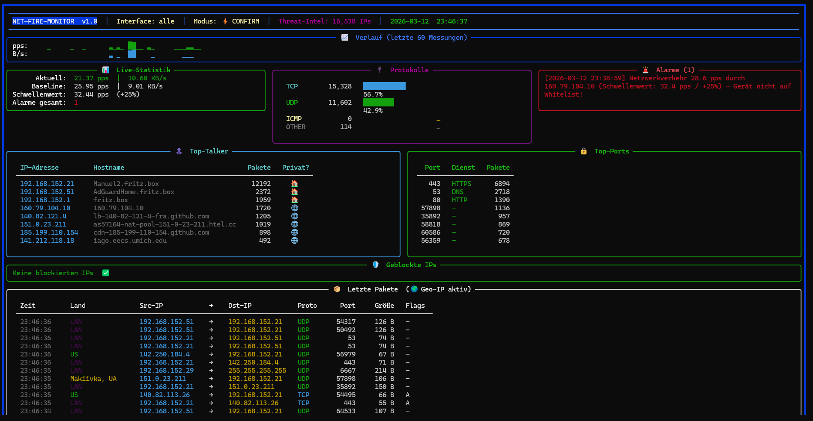

# Net-Fire-Monitor v1.0 – OpenScan Projekt

> **(C) 2023–2026 Manuel Person – Innobytix-IT**

---

> 🇩🇪 **Diese README ist zweisprachig. Der deutsche Teil befindet sich zuerst, der englische Teil folgt im Anschluss.**
> 🇬🇧 **This README is bilingual. The German section comes first, the English section follows below.**

---

# 🇩🇪 DEUTSCH

---

## Inhaltsverzeichnis

1. [Was ist Net-Fire-Monitor?](#was-ist-net-fire-monitor)
2. [Unterschied zu Net-Monitor v2.0](#unterschied-zu-net-monitor-v20)
3. [Voraussetzungen](#voraussetzungen)
4. [Installation & Start](#installation--start)
5. [E-Mail-Passwort sicher einrichten](#e-mail-passwort-sicher-einrichten)
6. [Konfiguration](#konfiguration)
7. [Firewall-Modi](#firewall-modi)
8. [Threat Intelligence](#threat-intelligence)
9. [Firewall-Regeln definieren](#firewall-regeln-definieren)
10. [E-Mail-Benachrichtigung](#e-mail-benachrichtigung)
11. [Dashboard-Übersicht](#dashboard-übersicht)
12. [Log-Dateien](#log-dateien)
13. [Ilija AI Agent Skill](#ilija-ai-agent-skill)
14. [Häufige Fragen (FAQ)](#häufige-fragen-faq)
15. [Sicherheitshinweise](#sicherheitshinweise)
16. [Projektstruktur auf GitHub](#projektstruktur-auf-github)

---

## Was ist Net-Fire-Monitor?

Net-Fire-Monitor ist ein aktives **Intrusion Prevention System (IPS)** für Windows, Linux und macOS.
Es basiert auf Net-Monitor v2.0 und erweitert diesen um vollständige Firewall-Automatisierung, Threat Intelligence, E-Mail-Benachrichtigungen und eine Regel-Engine.

Das Tool läuft als Terminal-Programm mit Live-Dashboard und überwacht den gesamten Netzwerkverkehr in Echtzeit.

---

## Unterschied zu Net-Monitor v2.0

| Feature | Net-Monitor v2.0 | Net-Fire-Monitor v1.0 |
|---------|-----------------|----------------------|
| Netzwerk-Überwachung | ✅ | ✅ |
| Live-Dashboard (Rich) | ✅ | ✅ |
| Geo-IP & DNS-Auflösung | ✅ | ✅ |
| Port-Scan-Erkennung | ✅ | ✅ |
| CSV-Report & Log-Rotation | ✅ | ✅ |
| **Firewall-Steuerung** | ❌ | ✅ Windows + Linux + macOS |
| **Firewall-Modi** | ❌ | ✅ monitor / confirm / auto |
| **Threat Intelligence** | ❌ | ✅ 15.000+ bekannte Bedrohungen |
| **E-Mail-Benachrichtigung** | ❌ | ✅ HTML-E-Mails via SMTP |
| **IP-Analyse in E-Mail** | ❌ | ✅ nslookup + Geo-IP automatisch |
| **Regel-Engine** | ❌ | ✅ Port/Protokoll-Regeln |
| **Firewall Rate Limiting** | ❌ | ✅ DDoS-resistent |
| **Ilija AI Agent Skill** | ❌ | ✅ Vollständige KI-Steuerung |
| Passwort-Sicherheit | ❌ Klartext | ✅ Umgebungsvariable |

---

## Voraussetzungen

- **Python 3.10** oder neuer
- **Windows**: [Npcap](https://npcap.com/#download) installiert + **Administratorrechte**
- **Linux / macOS**: Root-Rechte (`sudo`) + `iptables` bzw. `pfctl` vorhanden

Python-Pakete werden beim ersten Start **automatisch installiert**:
```
scapy · rich · plyer · geoip2 · requests
```

### Optional: Geo-IP-Datenbank

Für die Länder- und Stadtanzeige wird die kostenlose **GeoLite2-City**-Datenbank von MaxMind benötigt:

1. Konto erstellen: [maxmind.com/en/geolite2/signup](https://www.maxmind.com/en/geolite2/signup)
2. `GeoLite2-City.mmdb` herunterladen
3. Datei in dasselbe Verzeichnis wie `net_fire_monitor_v1.0.py` kopieren

---

## Installation & Start

```bash
# Windows (als Administrator ausführen!):
python net_fire_monitor_v1.0.py

# Linux / macOS (Root erforderlich):
sudo python3 net_fire_monitor_v1.0.py
```

Beim **ersten Start** richtet sich das Tool automatisch ein:
- Python-Pakete installieren
- Npcap-Hinweis (Windows)
- GeoLite2-Datenbank einrichten

Danach startet der **Konfigurations-Wizard** für alle Einstellungen.

---

## E-Mail-Passwort sicher einrichten

Das Passwort wird **niemals** in der Config-Datei gespeichert.
Es wird über die Umgebungsvariable `NFM_EMAIL_PASSWORD` geladen.

### Gmail – App-Passwort erstellen (Pflicht!)

> ⚠️ Das echte Google-Passwort funktioniert hier **nicht**. Google verlangt ein App-Passwort.

1. [myaccount.google.com/apppasswords](https://myaccount.google.com/apppasswords) aufrufen
2. Name: `NetFireMonitor` → **Erstellen**
3. Den 16-stelligen Code notieren (z. B. `abcd efgh ijkl mnop`)

### Umgebungsvariable setzen

**Windows** (dauerhaft, als Administrator):
```cmd
setx NFM_EMAIL_PASSWORD "abcdefghijklmnop" /M
```

**Linux / macOS** (dauerhaft in `~/.bashrc` oder `~/.zshrc`):
```bash
export NFM_EMAIL_PASSWORD="abcdefghijklmnop"
```

**Nur für eine Session:**
```bash
# Linux/macOS:
NFM_EMAIL_PASSWORD="abcdefghijklmnop" sudo -E python3 net_fire_monitor_v1.0.py

# Windows CMD:
set NFM_EMAIL_PASSWORD=abcdefghijklmnop && python net_fire_monitor_v1.0.py
```

---

## Konfiguration

Alle Einstellungen werden in `net_fire_monitor_config.json` gespeichert.

> ⚠️ **Diese Datei nicht auf GitHub hochladen!** Die mitgelieferte `.gitignore` schützt sie automatisch.

### Alle Parameter

| Parameter | Standard | Beschreibung |
|-----------|----------|--------------|
| `average_period` | `120` | Baseline-Messdauer in Sekunden |
| `monitor_interval` | `30` | Messintervall in Sekunden |
| `threshold` | `20` | Alarm-Schwellenwert in % über Baseline |
| `bpf_filter` | `"ip or ip6"` | Scapy BPF-Filter |
| `interface` | `""` | Netzwerk-Interface (`""` = alle) |
| `notify_desktop` | `true` | Desktop-Benachrichtigungen |
| `notify_log` | `true` | Log-Datei-Einträge |
| `resolve_dns` | `true` | DNS-Auflösung im Dashboard |
| `geo_lookup` | `true` | Geo-IP-Ländererkennung |
| `detect_portscan` | `true` | Port-Scan-Erkennung |
| `portscan_limit` | `100` | Ports pro 10 s → Portscan-Alarm |
| `whitelist` | `[]` | IPs ohne Traffic-Alarm |
| `blacklist` | `[]` | IPs mit sofortigem Alarm |
| `firewall_mode` | `"monitor"` | Firewall-Modus (siehe unten) |
| `firewall_rules` | `[]` | Benutzerdefinierte Regeln |
| `threat_intel_enabled` | `true` | Threat-Intel-Feeds aktivieren |
| `threat_intel_auto_block` | `false` | Bekannte böse IPs auto-blocken |
| `threat_intel_feeds` | `[...]` | Feed-URLs |
| `threat_intel_update_interval` | `3600` | Sekunden zwischen Feed-Updates |
| `email_enabled` | `false` | E-Mail-Benachrichtigungen |
| `email_smtp` | `"smtp.gmail.com"` | SMTP-Server |
| `email_port` | `587` | SMTP-Port |
| `email_user` | `""` | Absender E-Mail |
| `email_recipient` | `""` | Empfänger E-Mail |
| `export_csv` | `true` | CSV-Report speichern |
| `report_rotate` | `7` | Reports nach N Tagen löschen |

---

## Firewall-Modi

### 👁 monitor (Standard)
Nur beobachten. Keine automatischen Eingriffe. Ideal zum Einstieg und zum Kennenlernen des eigenen Netzwerks.

### ⚡ confirm
Bei einem Alarm wird eine E-Mail gesendet. Du entscheidest manuell ob blockiert wird.
Erfordert funktionierende E-Mail-Konfiguration.

### 🔥 auto
Verdächtige externe IPs werden **sofort automatisch blockiert**. Dabei gelten folgende Schutzmaßnahmen:
- IPs auf der **Whitelist** werden nie blockiert
- **Private/LAN-IPs** werden nie blockiert
- **Rate Limiting**: max. 30 Blocks pro Minute, min. 10 s Abstand pro IP
- Beim Beenden wird gefragt ob alle Regeln aufgehoben werden sollen

> ⚠️ Im `auto`-Modus können durch False Positives legitime Server temporär blockiert werden. Whitelist sorgfältig pflegen!

---

## Threat Intelligence

Das Tool lädt automatisch Listen bekannter Bedrohungs-IPs:

| Feed | Beschreibung |
|------|-------------|
| **Feodo Tracker** | Botnet Command & Control Server |
| **CINS Army** | Bekannte Angreifer-IPs |
| **Spamhaus DROP** | Gestohlene / kompromittierte Netze |

- Feeds werden alle **60 Minuten** aktualisiert
- Lokales Caching in `threat_intel_cache.txt` → schneller Start
- Beim Start typischerweise **15.000–17.000** bekannte böse IPs geladen

---

## Firewall-Regeln definieren

Regeln werden als Liste unter `firewall_rules` in der Config definiert:

```json
"firewall_rules": [
  {
    "proto": "tcp",
    "port": 23,
    "src_ip": "",
    "action": "block",
    "comment": "Telnet immer blockieren"
  },
  {
    "proto": "tcp",
    "port": 3389,
    "src_ip": "",
    "action": "alert",
    "comment": "RDP-Zugriff immer alarmieren"
  },
  {
    "proto": "any",
    "port": 0,
    "src_ip": "10.0.0.99",
    "action": "block",
    "comment": "Bestimmte IP immer blockieren"
  }
]
```

| Feld | Werte | Beschreibung |
|------|-------|-------------|
| `proto` | `tcp`, `udp`, `icmp`, `any` | Protokoll |
| `port` | `0`–`65535` (`0` = alle) | Ziel-Port |
| `src_ip` | IP oder `""` für alle | Quell-IP |
| `action` | `block`, `alert`, `allow` | Aktion |

---

## E-Mail-Benachrichtigung

Bei jedem Alarm sendet Net-Fire-Monitor eine HTML-E-Mail mit vollständiger IP-Analyse:

```
🚨 Net-Fire-Monitor Alarm

Zeitpunkt : 2026-03-14 10:27:17
Alarm     : Netzwerkverkehr 293.6 pps durch 2.16.168.125 ...

━━━━━━━━━━━━━━━━━━━━━━━━━━━━━━━━━━━━━━━━━
IP-Analyse: 2.16.168.125
━━━━━━━━━━━━━━━━━━━━━━━━━━━━━━━━━━━━━━━━━
Hostname  : a2-16-168-125.deploy.static.akamaitechnologies.com
Geo-IP    : Frankfurt am Main, Germany (DE)
Besitzer  : –
Bedrohung : ✅ Vermutlich Nein (Es liegen keine bekannten Bedrohungen durch diese IP vor)
━━━━━━━━━━━━━━━━━━━━━━━━━━━━━━━━━━━━━━━━━
Grund     : PPS_Exceeded
Modus     : confirm
```

Die IP-Analyse erfolgt automatisch über:
- **nslookup** (alle Plattformen) → Hostname
- **whois** (Linux/macOS) → Besitzer/Organisation
- **Geo-IP** (wenn GeoLite2-DB vorhanden) → Land & Stadt
- **Threat-Intel-Cache** → Bedrohungsstatus

---

## E-Mail-Benachrichtigung

Bei jedem Alarm sendet Net-Fire-Monitor eine HTML-E-Mail mit vollständiger IP-Analyse:

```
🚨 Net-Fire-Monitor Alarm

Zeitpunkt : 2026-03-14 10:27:17
Alarm     : Netzwerkverkehr 293.6 pps durch 2.16.168.125 ...

━━━━━━━━━━━━━━━━━━━━━━━━━━━━━━━━━━━━━━━━━
IP-Analyse: 2.16.168.125
━━━━━━━━━━━━━━━━━━━━━━━━━━━━━━━━━━━━━━━━━
Hostname  : a2-16-168-125.deploy.static.akamaitechnologies.com
Geo-IP    : Frankfurt am Main, Germany (DE)
Besitzer  : –
Bedrohung : ✅ Vermutlich Nein (Es liegen keine bekannten Bedrohungen durch diese IP vor)
━━━━━━━━━━━━━━━━━━━━━━━━━━━━━━━━━━━━━━━━━
Grund     : PPS_Exceeded
Modus     : confirm
```

Die IP-Analyse erfolgt automatisch über:
- **nslookup** (alle Plattformen) → Hostname
- **whois** (Linux/macOS) → Besitzer/Organisation
- **Geo-IP** (wenn GeoLite2-DB vorhanden) → Land & Stadt
- **Threat-Intel-Cache** → Bedrohungsstatus

---

## Dashboard-Übersicht



```
╔══════════════════════════════════════════════════════════════════╗
║  NET-FIRE-MONITOR v1.0  │  Interface: alle  │  Modus: ⚡ CONFIRM ║
║  Threat-Intel: 16.537 IPs  │  2026-03-14  10:29:40             ║
╠══════════════════════════════════════════════════════════════════╣
║  📈 Verlauf (letzte 60 Messungen)                               ║
╠══════════════╦══════════════════╦══════════════════════════════╣
║ 📊 Statistik ║ 🔌 Protokolle    ║ 🚨 Alarme                    ║
╠══════════════╩══════════════════╬══════════════════════════════╣
║ 🔝 Top-Talker (IP + Hostname)   ║ 🔒 Top-Ports                 ║
╠═════════════════════════════════╩══════════════════════════════╣
║ 🛡️  Geblockte IPs                                               ║
╠════════════════════════════════════════════════════════════════╣
║ 📦 Letzte Pakete  (🌍 Geo-IP aktiv)                             ║
╚════════════════════════════════════════════════════════════════╝
```

### Geo-IP Farbcodes

| Farbe | Bedeutung |
|-------|-----------|
| 🟢 Grün | LAN oder bekannte CDN/Cloud-Region |
| 🟡 Gelb | Unbekannte Region |
| ⬛ Dim | Nicht auflösbar |

---

## Log-Dateien

| Datei | Inhalt | Max. Größe |
|-------|--------|------------|
| `net_fire_monitor.log` | Alle Ereignisse & Alarme | 5 MB × 3 Backups |
| `firewall.log` | Alle Firewall-Aktionen | 2 MB × 5 Backups |
| `threat_intel_cache.txt` | Bekannte böse IPs (Cache) | variabel |
| `reports/*.csv` | Paket-Reports | rotiert nach N Tagen |

## Log-Dateien

| Datei | Inhalt | Max. Größe |
|-------|--------|------------|
| `net_fire_monitor.log` | Alle Ereignisse & Alarme | 5 MB × 3 Backups |
| `firewall.log` | Alle Firewall-Aktionen | 2 MB × 5 Backups |
| `threat_intel_cache.txt` | Bekannte böse IPs (Cache) | variabel |
| `reports/*.csv` | Paket-Reports | rotiert nach N Tagen |

---

## Ilija AI Agent Skill

Net-Fire-Monitor kann vollständig von **Ilija** (dem KI-Agenten) gesteuert werden.

### Installation

1. `net_fire_monitor_skill.py` in Ilijas `skills/`-Ordner kopieren
2. Ilija neu starten
3. Pfad einmalig einrichten:

```
nfm_pfad_einrichten(pfad="C:\Users\...\net_monitor\V2.1")
```

### Verfügbare Skill-Funktionen

| Funktion | Beschreibung |
|----------|-------------|
| `nfm_pfad_einrichten(pfad)` | ⚙️ Einmalige Einrichtung – Pfad zum Monitor angeben |
| `nfm_pfad_anzeigen()` | Konfigurierten Pfad anzeigen |
| `nfm_status()` | Vollständiger Status (Modus, Whitelist, Threat-Intel usw.) |
| `nfm_alarme_lesen(anzahl)` | Letzte N Alarme aus dem Log lesen |
| `nfm_firewall_log_lesen(anzahl)` | Letzte N Firewall-Aktionen lesen |
| `nfm_modus_setzen(modus)` | Firewall-Modus ändern: monitor / confirm / auto |
| `nfm_schwellenwert_setzen(prozent)` | Alarm-Empfindlichkeit anpassen |
| `nfm_whitelist_anzeigen()` | Alle Whitelist-IPs anzeigen |
| `nfm_whitelist_hinzufuegen(ip)` | IP zur Whitelist hinzufügen |
| `nfm_whitelist_entfernen(ip)` | IP von der Whitelist entfernen |
| `nfm_blacklist_hinzufuegen(ip)` | IP zur Blacklist hinzufügen |
| `nfm_blacklist_entfernen(ip)` | IP von der Blacklist entfernen |
| `nfm_ip_analysieren(ip)` | IP vollständig analysieren (Hostname, Geo, Threat-Intel) |
| `nfm_ip_blockieren(ip, grund)` | IP direkt über Systemfirewall blockieren |
| `nfm_ip_freigeben(ip)` | IP-Blockierung aufheben |
| `nfm_autonome_entscheidung(ip)` | 🤖 Ilija analysiert und entscheidet selbstständig |

### Beispiel-Dialog mit Ilija

```
Du:    Ilija, eine IP macht mir Sorgen: 185.220.101.45
Ilija: [ruft nfm_autonome_entscheidung(ip="185.220.101.45") auf]

       🔍 IP-Analyse: 185.220.101.45
       Hostname  : tor-exit.example.com
       Geo-IP    : Netherlands (NL)
       Bedrohung : ☠️  JA – in Threat-Intel-Liste!

       🤖 Ilija-Entscheidung : 🚫 BLOCKIEREN
       📝 Begründung: IP ist in bekannten Threat-Intel-Listen gelistet.
       ✅ IP wurde automatisch blockiert.
```

### Sicherheits-Schutzmaßnahmen im Skill

- **Private/LAN-IPs** werden vom Skill niemals blockiert
- Ilija prüft immer zuerst Threat-Intel + Hostname bevor sie blockiert
- Bekannte CDN/Cloud-Anbieter (Akamai, Cloudflare, Meta, Google usw.) werden automatisch zur Whitelist hinzugefügt statt blockiert

---

## Häufige Fragen (FAQ)

**Das Tool blockiert keine IPs obwohl der Modus auf `auto` steht.**
→ Administratorrechte prüfen. Firewall-Regeln erfordern erhöhte Rechte (Windows: Als Administrator starten / Linux: `sudo`).

**E-Mail-Versand schlägt fehl (`BadCredentials`).**
→ Bei Gmail kein echtes Passwort, sondern ein App-Passwort verwenden. Siehe Abschnitt „E-Mail-Passwort sicher einrichten".

**Ich habe mich selbst ausgesperrt / eine IP fälschlicherweise blockiert.**
→ Tool beenden (Strg+C) → beim Beenden „Alle Firewall-Regeln aufheben?" mit `y` bestätigen.
Alternativ manuell:
```cmd
# Windows:
netsh advfirewall firewall delete rule name="NetFireMon_Block_1.2.3.4"

# Linux:
iptables -D INPUT -s 1.2.3.4 -j DROP
```

**Zu viele False-Positive-Alarme.**
→ Bekannte IPs zur Whitelist hinzufügen. Den `threshold`-Wert erhöhen (z. B. auf 40–50 %). Auf `confirm`-Modus wechseln.

**Die Threat-Intel-Liste ist leer.**
→ Internetverbindung prüfen. Beim nächsten Start wird aus dem Cache geladen.

**ipinfo.io / ip-api.com nicht erreichbar (z. B. durch AdGuard geblockt).**
→ Kein Problem – das Tool nutzt `nslookup` und `whois` direkt, keine externen APIs.

---

## Sicherheitshinweise

- **Nur im eigenen Netzwerk betreiben!** Paketerfassung in fremden Netzwerken ist in den meisten Ländern illegal.
- Die Config-Datei enthält persönliche Daten → **nicht auf GitHub hochladen** (`.gitignore` ist beigefügt).
- Das E-Mail-Passwort wird nicht in der Config gespeichert, sondern über `NFM_EMAIL_PASSWORD` geladen.
- Im `auto`-Modus können False Positives legitime IPs blockieren. Whitelist sorgfältig pflegen.

---

## Projektstruktur auf GitHub

```
Net_fire_monitor_v1.0/
├── net_fire_monitor_v1.0.py       ← Hauptprogramm
├── net_fire_monitor_skill.py      ← Ilija AI Agent Skill
├── README.md                      ← Diese Datei
├── .gitignore                     ← Schützt Config & Logs
└── Screenshots/
    └── Screenshot_1.png           ← Dashboard-Screenshot
```

**Nicht im Repository (durch .gitignore geschützt):**
```
net_fire_monitor_config.json   ← persönliche Einstellungen
net_fire_monitor.log           ← Logdatei
firewall.log                   ← Firewall-Aktionen
threat_intel_cache.txt         ← IP-Listen Cache
GeoLite2-City.mmdb             ← Geo-IP-Datenbank (zu groß)
reports/                       ← CSV-Reports
```

---

## Projektstruktur auf GitHub

```
Net_fire_monitor_v1.0/
├── net_fire_monitor_v1.0.py       ← Hauptprogramm
├── net_fire_monitor_skill.py      ← Ilija AI Agent Skill
├── README.md                      ← Diese Datei
├── .gitignore                     ← Schützt Config & Logs
└── Screenshots/
    └── Screenshot_1.png           ← Dashboard-Screenshot
```

**Nicht im Repository (durch .gitignore geschützt):**
```
net_fire_monitor_config.json   ← persönliche Einstellungen
net_fire_monitor.log           ← Logdatei
firewall.log                   ← Firewall-Aktionen
threat_intel_cache.txt         ← IP-Listen Cache
GeoLite2-City.mmdb             ← Geo-IP-Datenbank (zu groß)
reports/                       ← CSV-Reports
```

---

*Net-Fire-Monitor ist ein Open-Source-Projekt und wird ohne Gewährleistung bereitgestellt.*
*Verwendung auf eigene Verantwortung – Paketerfassung nur in eigenen Netzwerken!*

---
---

# 🇬🇧 ENGLISH

---

## Table of Contents

1. [What is Net-Fire-Monitor?](#what-is-net-fire-monitor)
2. [Differences from Net-Monitor v2.0](#differences-from-net-monitor-v20)
3. [Requirements](#requirements)
4. [Installation & Start](#installation--start-1)
5. [Setting Up the E-Mail Password Securely](#setting-up-the-e-mail-password-securely)
6. [Configuration](#configuration)
7. [Firewall Modes](#firewall-modes)
8. [Threat Intelligence](#threat-intelligence-1)
9. [Defining Firewall Rules](#defining-firewall-rules)
10. [E-Mail Notifications](#e-mail-notifications)
11. [Dashboard Overview](#dashboard-overview)
12. [Log Files](#log-files)
13. [Ilija AI Agent Skill](#ilija-ai-agent-skill-1)
14. [FAQ](#faq)
15. [Security Notes](#security-notes)
16. [Project Structure on GitHub](#project-structure-on-github)

---

## What is Net-Fire-Monitor?

Net-Fire-Monitor is an active **Intrusion Prevention System (IPS)** for Windows, Linux and macOS.
Based on Net-Monitor v2.0, it extends it with full firewall automation, Threat Intelligence, e-mail notifications and a rule engine.

The tool runs as a terminal application with a live dashboard, monitoring all network traffic in real time.

---

## Differences from Net-Monitor v2.0

| Feature | Net-Monitor v2.0 | Net-Fire-Monitor v1.0 |
|---------|-----------------|----------------------|
| Network Monitoring | ✅ | ✅ |
| Live Dashboard (Rich) | ✅ | ✅ |
| Geo-IP & DNS Resolution | ✅ | ✅ |
| Port Scan Detection | ✅ | ✅ |
| CSV Report & Log Rotation | ✅ | ✅ |
| **Firewall Control** | ❌ | ✅ Windows + Linux + macOS |
| **Firewall Modes** | ❌ | ✅ monitor / confirm / auto |
| **Threat Intelligence** | ❌ | ✅ 15,000+ known threats |
| **E-Mail Notifications** | ❌ | ✅ HTML e-mails via SMTP |
| **IP Analysis in E-Mail** | ❌ | ✅ nslookup + Geo-IP automatic |
| **Rule Engine** | ❌ | ✅ Port/protocol rules |
| **Firewall Rate Limiting** | ❌ | ✅ DDoS-resistant |
| **Ilija AI Agent Skill** | ❌ | ✅ Full AI control |
| Password Security | ❌ Plaintext | ✅ Environment variable |

---

## Requirements

- **Python 3.10** or newer
- **Windows**: [Npcap](https://npcap.com/#download) installed + **Administrator rights**
- **Linux / macOS**: Root rights (`sudo`) + `iptables` or `pfctl` available

Python packages are **installed automatically** on first launch:
```
scapy · rich · plyer · geoip2 · requests
```

### Optional: Geo-IP Database

The free **GeoLite2-City** database from MaxMind is required for country and city display:

1. Create an account: [maxmind.com/en/geolite2/signup](https://www.maxmind.com/en/geolite2/signup)
2. Download `GeoLite2-City.mmdb`
3. Copy the file to the same directory as `net_fire_monitor_v1.0.py`

---

## Installation & Start

```bash
# Windows (run as Administrator!):
python net_fire_monitor_v1.0.py

# Linux / macOS (root required):
sudo python3 net_fire_monitor_v1.0.py
```

On **first launch** the tool sets itself up automatically:
- Install Python packages
- Npcap instructions (Windows)
- GeoLite2 database setup

Then the **configuration wizard** starts for all settings.

---

## Setting Up the E-Mail Password Securely

The password is **never** stored in the config file.
It is loaded via the environment variable `NFM_EMAIL_PASSWORD`.

### Gmail – Create an App Password (Required!)

> ⚠️ Your real Google password will **not** work here. Google requires an App Password.

1. Go to [myaccount.google.com/apppasswords](https://myaccount.google.com/apppasswords)
2. Name: `NetFireMonitor` → **Create**
3. Note the 16-digit code (e.g. `abcd efgh ijkl mnop`)

### Set the Environment Variable

**Windows** (permanent, as Administrator):
```cmd
setx NFM_EMAIL_PASSWORD "abcdefghijklmnop" /M
```

**Linux / macOS** (permanent in `~/.bashrc` or `~/.zshrc`):
```bash
export NFM_EMAIL_PASSWORD="abcdefghijklmnop"
```

**For a single session only:**
```bash
# Linux/macOS:
NFM_EMAIL_PASSWORD="abcdefghijklmnop" sudo -E python3 net_fire_monitor_v1.0.py

# Windows CMD:
set NFM_EMAIL_PASSWORD=abcdefghijklmnop && python net_fire_monitor_v1.0.py
```

---

## Configuration

All settings are stored in `net_fire_monitor_config.json`.

> ⚠️ **Do not upload this file to GitHub!** The included `.gitignore` protects it automatically.

### All Parameters

| Parameter | Default | Description |
|-----------|---------|-------------|
| `average_period` | `120` | Baseline measurement duration in seconds |
| `monitor_interval` | `30` | Measurement interval in seconds |
| `threshold` | `20` | Alert threshold in % above baseline |
| `bpf_filter` | `"ip or ip6"` | Scapy BPF filter |
| `interface` | `""` | Network interface (`""` = all) |
| `notify_desktop` | `true` | Desktop notifications |
| `notify_log` | `true` | Log file entries |
| `resolve_dns` | `true` | DNS resolution in dashboard |
| `geo_lookup` | `true` | Geo-IP country detection |
| `detect_portscan` | `true` | Port scan detection |
| `portscan_limit` | `100` | Ports per 10 s → port scan alert |
| `whitelist` | `[]` | IPs without traffic alerts |
| `blacklist` | `[]` | IPs with immediate alert |
| `firewall_mode` | `"monitor"` | Firewall mode (see below) |
| `firewall_rules` | `[]` | Custom rules |
| `threat_intel_enabled` | `true` | Enable Threat Intel feeds |
| `threat_intel_auto_block` | `false` | Auto-block known malicious IPs |
| `threat_intel_feeds` | `[...]` | Feed URLs |
| `threat_intel_update_interval` | `3600` | Seconds between feed updates |
| `email_enabled` | `false` | E-mail notifications |
| `email_smtp` | `"smtp.gmail.com"` | SMTP server |
| `email_port` | `587` | SMTP port |
| `email_user` | `""` | Sender e-mail |
| `email_recipient` | `""` | Recipient e-mail |
| `export_csv` | `true` | Save CSV report |
| `report_rotate` | `7` | Delete reports after N days |

---

## Firewall Modes

### 👁 monitor (Default)
Observe only. No automatic actions. Ideal for getting started and learning your network.

### ⚡ confirm
An e-mail is sent on every alert. You decide manually whether to block.
Requires working e-mail configuration.

### 🔥 auto
Suspicious external IPs are **blocked immediately and automatically**. The following safeguards apply:
- IPs on the **whitelist** are never blocked
- **Private/LAN IPs** are never blocked
- **Rate limiting**: max. 30 blocks per minute, min. 10 s gap per IP
- On exit you will be asked whether all rules should be removed

> ⚠️ In `auto` mode, false positives can temporarily block legitimate servers. Maintain your whitelist carefully!

---

## Threat Intelligence

The tool automatically downloads lists of known malicious IPs:

| Feed | Description |
|------|-------------|
| **Feodo Tracker** | Botnet Command & Control servers |
| **CINS Army** | Known attacker IPs |
| **Spamhaus DROP** | Stolen / compromised networks |

- Feeds are updated every **60 minutes**
- Local caching in `threat_intel_cache.txt` → fast startup
- Typically **15,000–17,000** known malicious IPs loaded at startup

---

## Defining Firewall Rules

Rules are defined as a list under `firewall_rules` in the config:

```json
"firewall_rules": [
  {
    "proto": "tcp",
    "port": 23,
    "src_ip": "",
    "action": "block",
    "comment": "Always block Telnet"
  },
  {
    "proto": "tcp",
    "port": 3389,
    "src_ip": "",
    "action": "alert",
    "comment": "Always alert on RDP access"
  }
]
```

| Field | Values | Description |
|-------|--------|-------------|
| `proto` | `tcp`, `udp`, `icmp`, `any` | Protocol |
| `port` | `0`–`65535` (`0` = all) | Destination port |
| `src_ip` | IP or `""` for all | Source IP |
| `action` | `block`, `alert`, `allow` | Action |

---

## E-Mail Notifications

Net-Fire-Monitor sends an HTML e-mail with full IP analysis on every alert:

```
🚨 Net-Fire-Monitor Alert

Timestamp : 2026-03-14 10:27:17
Alert     : Network traffic 293.6 pps from 2.16.168.125 ...

━━━━━━━━━━━━━━━━━━━━━━━━━━━━━━━━━━━━━━━━━
IP Analysis: 2.16.168.125
━━━━━━━━━━━━━━━━━━━━━━━━━━━━━━━━━━━━━━━━━
Hostname  : a2-16-168-125.deploy.static.akamaitechnologies.com
Geo-IP    : Frankfurt am Main, Germany (DE)
Owner     : –
Threat    : ✅ Probably No (no known threats from this IP)
━━━━━━━━━━━━━━━━━━━━━━━━━━━━━━━━━━━━━━━━━
Reason    : PPS_Exceeded
Mode      : confirm
```

---

## Dashboard Overview


---

## Ilija AI Agent Skill

Net-Fire-Monitor can be fully controlled by **Ilija** (the AI agent).

### Installation

1. Copy `net_fire_monitor_skill.py` to Ilija's `skills/` folder
2. Restart Ilija
3. Set up the path once:

```
nfm_pfad_einrichten(pfad="C:\Users\...\net_monitor\V2.1")
```

### Available Skill Functions

| Function | Description |
|----------|-------------|
| `nfm_pfad_einrichten(pfad)` | ⚙️ One-time setup – set path to monitor |
| `nfm_pfad_anzeigen()` | Show configured path |
| `nfm_status()` | Full status (mode, whitelist, threat intel etc.) |
| `nfm_alarme_lesen(anzahl)` | Read last N alerts from log |
| `nfm_firewall_log_lesen(anzahl)` | Read last N firewall actions |
| `nfm_modus_setzen(modus)` | Change firewall mode: monitor / confirm / auto |
| `nfm_schwellenwert_setzen(prozent)` | Adjust alert sensitivity |
| `nfm_whitelist_anzeigen()` | Show all whitelist IPs |
| `nfm_whitelist_hinzufuegen(ip)` | Add IP to whitelist |
| `nfm_whitelist_entfernen(ip)` | Remove IP from whitelist |
| `nfm_blacklist_hinzufuegen(ip)` | Add IP to blacklist |
| `nfm_blacklist_entfernen(ip)` | Remove IP from blacklist |
| `nfm_ip_analysieren(ip)` | Full IP analysis (hostname, geo, threat intel) |
| `nfm_ip_blockieren(ip, grund)` | Block IP directly via system firewall |
| `nfm_ip_freigeben(ip)` | Remove IP block |
| `nfm_autonome_entscheidung(ip)` | 🤖 Ilija analyses and decides autonomously |

### Example Dialogue with Ilija

```
You:   Ilija, I'm worried about this IP: 185.220.101.45
Ilija: [calls nfm_autonome_entscheidung(ip="185.220.101.45")]

       🔍 IP Analysis: 185.220.101.45
       Hostname  : tor-exit.example.com
       Geo-IP    : Netherlands (NL)
       Threat    : ☠️  YES – in Threat Intel list!

       🤖 Ilija Decision : 🚫 BLOCK
       📝 Reason: IP is listed in known Threat Intel feeds.
       ✅ IP has been blocked automatically.
```

### Security Safeguards in the Skill

- **Private/LAN IPs** are never blocked by the skill
- Ilija always checks Threat Intel + hostname before blocking
- Known CDN/cloud providers (Akamai, Cloudflare, Meta, Google etc.) are automatically whitelisted instead of blocked

---

## FAQ

**The tool is not blocking IPs even though the mode is set to `auto`.**
→ Check administrator rights. Firewall rules require elevated privileges (Windows: run as Administrator / Linux: `sudo`).

**E-mail sending fails (`BadCredentials`).**
→ For Gmail, use an App Password, not your real password. See section "Setting Up the E-Mail Password Securely".

**I accidentally blocked myself / a legitimate IP.**
→ Stop the tool (Ctrl+C) → confirm "Remove all firewall rules?" with `y` on exit.
Or remove manually:
```cmd
# Windows:
netsh advfirewall firewall delete rule name="NetFireMon_Block_1.2.3.4"

# Linux:
iptables -D INPUT -s 1.2.3.4 -j DROP
```

**Too many false positive alerts.**
→ Add known IPs to the whitelist. Increase the `threshold` value (e.g. to 40–50 %). Switch to `confirm` mode.

**The Threat Intel list is empty.**
→ Check your internet connection. On next start the tool loads from cache if available.

**ipinfo.io / ip-api.com not reachable (e.g. blocked by AdGuard).**
→ No problem – the tool uses `nslookup` and `whois` directly, no external APIs needed.

---

## Security Notes

- **Only use on your own network!** Packet capture on foreign networks is illegal in most countries.
- The config file contains personal data → **do not upload to GitHub** (`.gitignore` is included).
- The e-mail password is not stored in the config – it is loaded via `NFM_EMAIL_PASSWORD`.
- In `auto` mode, false positives can block legitimate IPs. Maintain your whitelist carefully.

---

## Project Structure on GitHub

```
Net_fire_monitor_v1.0/
├── net_fire_monitor_v1.0.py       ← Main program
├── net_fire_monitor_skill.py      ← Ilija AI Agent Skill
├── README.md                      ← This file
├── .gitignore                     ← Protects config & logs
└── Screenshots/
    └── Screenshot_1.png           ← Dashboard screenshot
```

**Not in repository (protected by .gitignore):**
```
net_fire_monitor_config.json   ← personal settings
net_fire_monitor.log           ← log file
firewall.log                   ← firewall actions
threat_intel_cache.txt         ← IP list cache
GeoLite2-City.mmdb             ← Geo-IP database (too large)
reports/                       ← CSV reports
```

---

*Net-Fire-Monitor is an open-source project and is provided without warranty.*
*Use at your own risk – packet capture only on your own networks!*
